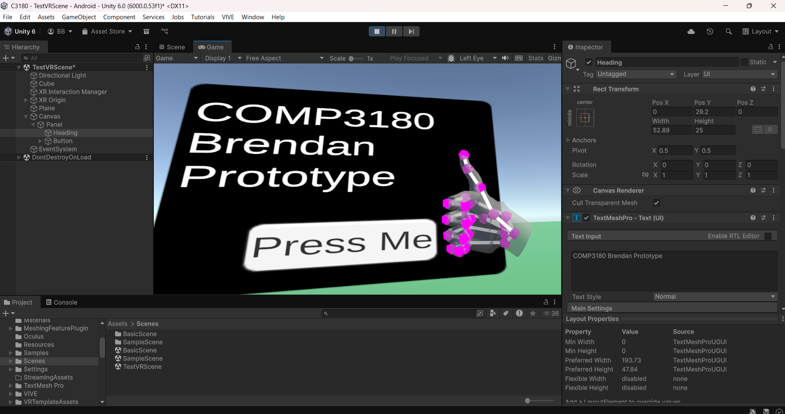
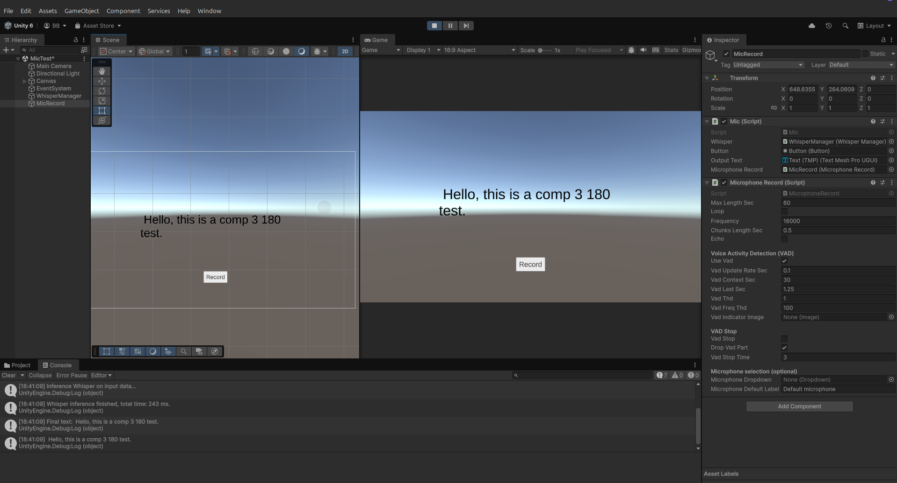

# COMP3180-final-project

Brendan

# Demo

exe versions of the demo (small and tiny model) (MQ email required to access link)
- https://drive.google.com/drive/folders/1L8Te8we6iQD3SOx39wb05Gb_YwVikqqr?usp=sharing

## Playing through Unity Application

Add the C3180 folder as a new project for Unity (recommended version 6000.0.53f1)
Open Scene "TestVRScene" in /Final Project" folder.
Check the "WhisperManager" empty gameobject, check that there is a valid model path.
- example: "Whisper/ggml-tiny.en.bin"

### Quest 3 Instructions
Download and install SteamLink from the quest store
Download and install SteamVR on your personal device (laptop/desktop preferred)
Log into your steam account on both devices.
(Make sure both devices are on the same network) launch SteamLink on the Quest and select your device to pair.
Run the Unity application and it should display through the headset

### HTC Vive Instructions
Download and install Vive Hub for your laptop/desktop
Download and install SteamVR on your personal device (laptop/desktop preferred)
launch Vive Hub on your laptop/computer
(Make sure the headset and the laptop/desktop are on the same network)
- If using a link cable, plug the cable into both your headset and laptop/PC, select Business stream and it should pair
- If on wifi/streaming, open the Vive headset Library and run Business streaming. It should let you select your device to pair
Run the unity application and it should display through the headset

# Weekly Diary

## Week 1 - Selecting a Project

Discussed the topics with Mitchell and Oliver. We agreed on the following topic:
Virtual Reality gesture/motion recognition and speech recognition working together.

## Week 2 - Familiarising yourself with the tools

## Software research

Found a speech recognition plugin for unity called whispers.unity:
https://github.com/Macoron/whisper.unity

Found some VR related plugins:
https://docs.unity3d.com/Packages/com.unity.xr.hands@1.6/manual/index.html

Meta hand pose detection:
https://developers.meta.com/horizon/documentation/unity/unity-isdk-hand-pose-detection/

Meta body pose detection:
https://developers.meta.com/horizon/documentation/unity/unity-isdk-body-pose-detection

Looked at openxr:
https://docs.unity3d.com/Packages/com.unity.xr.openxr@1.15/manual/index.html

## Assignment work

Presentation worked on:
- Description of topic & why is it relevant for advanced game development study
- Example games that utilise speech recognition in the game
- Example games that utilise gesture/motion recognition in VR games
- Why it is relevant to advanced game development study

## Literature review

None so far, need to confirm with the staff on what research papers im looking for exactly

## Week 3 - Reading and prototyping

Oliver confirmed what research I should be looking for.
Found some research on both speech recognition and vr gesture recognition:

- Voice Recognition Systems in Virtual Reality Analyzing Methods, Challenges, and Development Requirements
- Developers Meta Horizon - hands
- Advances in Distributed Computing and Machine Learning

Presentation worked on:
- Follow up on description of topic & why is it relevant for advanced game development study
- Follow up on example games that utilise speech recognition in the game
- Review of key literature
- Learning Goals and Draft Project Proposal

Quest 3 headset pair working now so I can play in Unity in play mode in VR

## Week 4 - Reading and prototyping

Completed research presentation slides/video

**Research papers:**
- Virtual Gaming Using Gesture Recognition Model - Virtual Gaming Using Gesture Recognition Model https://link.springer.com/chapter/10.1007/978-981-16-4807-6_12
- Voice Recognition Systems in Virtual Reality - Analyzing Methods, Challenges, and Development Requirements https://www.theseus.fi/bitstream/handle/10024/883616/Hypponen_Mick.pdf?sequence=2

**General References:**
- OpenXR
- XRHands
- Meta Hands
- WhsipersAI
- Vosk

## Week 5 - Presentations

Completed presentation in class.
Feedback from students/staff asked questions like:
- How can you prevent accidental spell casting?
- Is this going to focus on dynamic or static gestures?
- How are you going to analyse/present the data?

Mitchell offered to use his "Controls for Social VR platform" as a foundation for my project.
More feedback was provided on specific research areas to look for in the research proposal assessment.

## Week 6 - Presentations

Continued presentations this week.

## Week 7 - Finalising your Research Report

Further research in my research proposal.

Literature review on the following sources:

- Mick Hyppönen Voice Recognition Systems in Virtual Reality Analyzing Methods, Challenges, and Development Requirements Bachelor of Culture and Arts Degree Programme in Design. (n.d.). Retrieved September 13, 2025, from [https://www.theseus.fi/bitstream/handle/10024/883616/Hypponen_Mick.pdf?sequence=2](https://www.theseus.fi/bitstream/handle/10024/883616/Hypponen_Mick.pdf?sequence=2)
- Sahoo, J. P., Tripathy, A. K., Mohanty, M., Li, K.-C., & Nayak, A. K. (2022). Advances in distributed computing and machine learning (pp. 114–124). In Lecture notes in networks and systems. Springer International Publishing.
[https://doi.org/10.1007/978-981-16-4807-6](https://doi.org/10.1007/978-981-16-4807-6)
- Fang, K., & Wang, J. (2024). Interactive Design with Gesture and Voice Recognition in Virtual Teaching Environments. IEEE Access, 1–1.
[https://doi.org/10.1109/access.2023.3348846](https://doi.org/10.1109/access.2023.3348846)
- Oswaldo Mendoza Herbert, Pérez-Granados, D., Alberto, M., Rodrigo Cadena Martínez, Alberto, C., & Antonio, M. (2024). Static and Dynamic Hand Gestures: A Review of Techniques of Virtual Reality Manipulation. Sensors, 24(12), 3760–3760.
[https://doi.org/10.3390/s24123760](https://doi.org/10.3390/s24123760)
- Liao, Y.-C., & Chang, S.-W. (2025). A Study on the Application of Deep Learning-Based Gesture Recognition Technology in VR Magic Games. Lecture Notes in Electrical Engineering, 120–125. [https://doi.org/10.1007/978-981-96-2395-2_21](https://doi.org/10.1007/978-981-96-2395-2_21)

Two prototypes to get VR Hands and voice activation working in a seperate scene:

## Week 8 - Developing your Project

I was mostly working to get VR working in Unity with my own headset. This was a very difficult task as I had never encountered this before. However, after research and trial and error I managed to get it working.

## Mid-semster Break

During the mid semester break, I worked on setting up a basic scene (plane, vr template, simple materials/colours) and also worked on getting Whispers imported and implemented into the project. This required me importing the Unity Asset from the projects GitHub.

- https://github.com/Macoron/whisper.unity
- https://docs.unity3d.com/Packages/com.unity.xr.hands@1.7/manual/project-setup/install-xrhands.html

## Week 9 - Developing your Project

this was looking into the XR Hands plugin from XR to set up gesture detection and a custom script to interact with both XRHands and Whispers. This is where I was forced to deviate from the original proposal, I focused heavily on static gestures than dynamic gestures. XRHands only had static gesture capabilities.

- Source: https://docs.unity3d.com/Packages/com.unity.xr.hands@1.7/manual/gestures/static-hand-gesture.html
- Source: https://docs.unity3d.com/Packages/com.unity.xr.hands@1.7/manual/gestures/building-blocks.html

## Week 10 - Developing your Project

this was looking into only having have a custom gesture (created using XRHands Gesture Detection) work in my custom script to call the start/stop function of whispers, while the player is looking at the target

- Source: https://docs.unity3d.com/Packages/com.unity.xr.hands@1.7/manual/gestures/custom-gestures.html
- Source: https://docs.unity3d.com/Packages/com.unity.xr.hands@1.7/manual/gestures/hand-shapes.html
- Source: https://docs.unity3d.com/Packages/com.unity.xr.hands@1.7/manual/gestures/hand-poses.html

## Week 11 - Evaluation

I moved the project to being run on a dedicated windows machine, then streaming the game to a VR headset. I also moved from using XR hand poses to using XR Hand shapes. The difference between the two is a Pose only checks if the finger gesture is met, shapes need both the pose and hand orientation and target settings met

- https://developer.valvesoftware.com/wiki/SteamVR
- https://store.steampowered.com/remoteplay

## Week 12 - Evaluation

I focused more on my evaluation and participant demo testing. This was done mostly during the week 12 SGTA from students who were free to do my test and at my place of work in the office. I also implemented two different demo's using two different voice models. One was a tiny file roughly (30mb) and the other was a small bin file (roughly 200mb)

## Week 13 - Finalising your Project Report and Deliverables

Week 13, no major changes were done, this was mostly focused on documentation, creating the portfolio video and getting ready for submission.